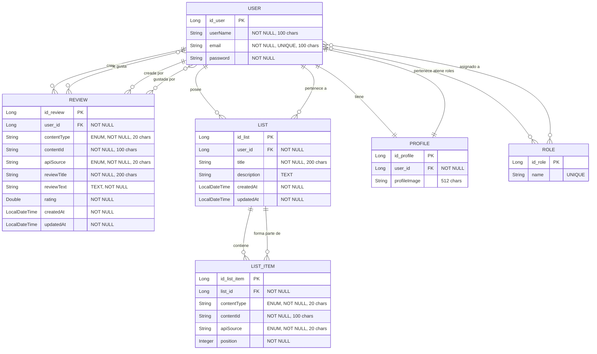
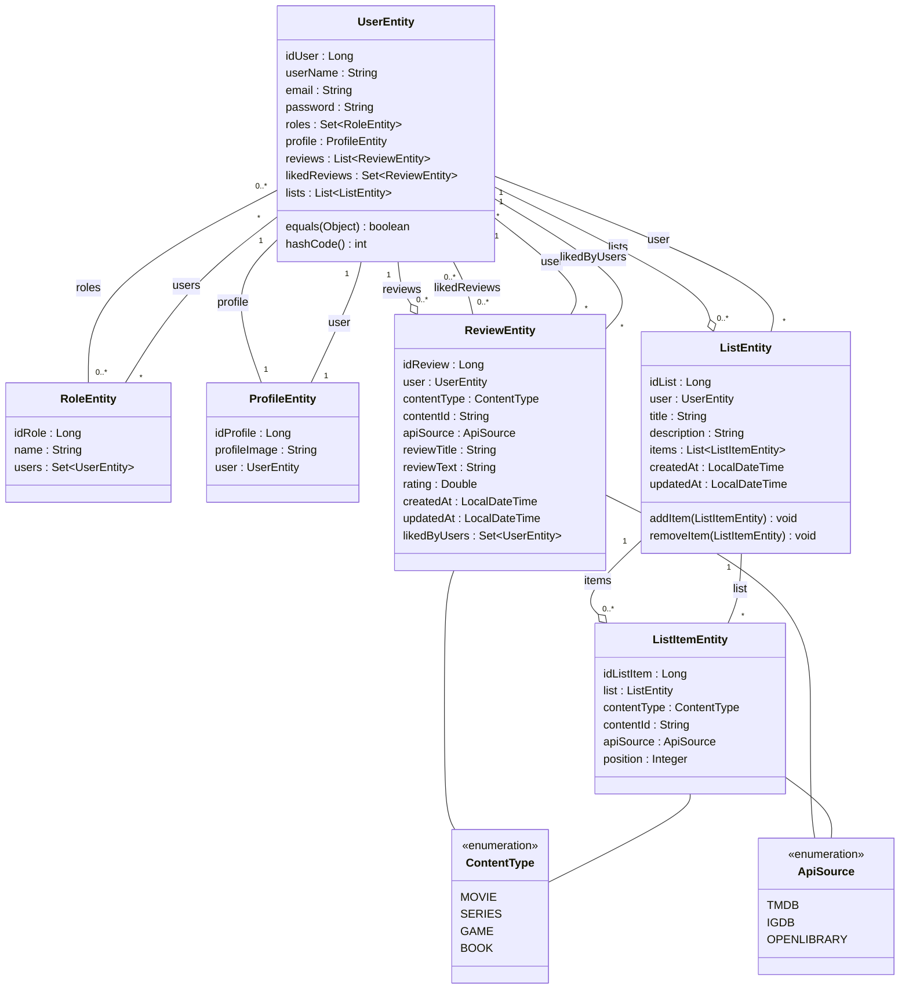

# ReviewVerso Backend

## Introduction

**ReviewVerso** is a comprehensive content review and list management platform that allows users to create reviews and curated lists of movies, series, books, and video games. The backend is built with Spring Boot 3.5.6 and provides a RESTful API with JWT authentication, integrating with external APIs like TMDB (The Movie Database), IGDB (Internet Game Database), and Open Library.

The platform enables users to:
- Create and manage detailed reviews with ratings
- Build and organize custom lists of multimedia content
- Interact with other users' reviews through a like system
- Manage user profiles with custom images
- Authenticate securely using JWT tokens

## Functional Requirements

### User Management
- **User Registration**: New users can register with username, email, and password
- **Authentication**: JWT-based authentication system with role-based access control (USER, ADMIN)
- **User Profiles**: Each user has a personalized profile with custom profile images
- **Role Management**: Support for multiple roles per user with ManyToMany relationship

### Review System
- **Create Reviews**: Users can create reviews for movies, series, games, and books
- **Review Details**: Each review includes title, text content, rating (0-10), content type, and API source
- **Like System**: Users can like reviews from other users (ManyToMany relationship)
- **Timestamps**: Automatic tracking of creation and update times
- **User Ownership**: Reviews are associated with their creators

### List Management
- **Custom Lists**: Users can create personalized lists of content
- **List Items**: Each list contains multiple items with specific content references
- **Ordering**: Items within lists maintain position for custom ordering
- **CRUD Operations**: Full Create, Read, Update, Delete operations on lists
- **Cascade Operations**: Deleting a list removes all associated items

### File Management
- **Image Upload**: Support for profile image uploads
- **File Storage**: Local file storage system with configurable upload directory
- **File Validation**: Size and type validation for uploaded files

### Security Features
- **JWT Authentication**: Secure token-based authentication
- **Password Encryption**: BCrypt password hashing
- **Role-Based Access**: Different access levels for users and administrators
- **CORS Configuration**: Configurable cross-origin resource sharing
- **Exception Handling**: Centralized error handling with meaningful messages

## Technologies

### Core Framework
- **Java 21**: Latest LTS version of Java
- **Spring Boot 3.5.6**: Main application framework
- **Maven**: Dependency management and build tool

### Spring Boot Starters
- **Spring Data JPA**: Object-relational mapping and database operations
- **Spring Security**: Authentication and authorization
- **Spring Web**: RESTful API development
- **Spring OAuth2 Resource Server**: JWT token handling
- **Spring Mail**: Email functionality
- **Spring Validation**: Input validation with Jakarta Bean Validation

### Database
- **MySQL**: Production database (via `spring.profiles.active=devmysql`)
- **H2 Database**: In-memory database for development and testing
- **Docker Compose**: MySQL containerization support

### Security & Authentication
- **Spring Security**: Core security framework
- **JWT (JSON Web Tokens)**: Token-based authentication
- **BCrypt**: Password encoding algorithm

### Development Tools
- **Lombok**: Reduces boilerplate code with annotations
- **Spring Boot DevTools**: Hot reload and development utilities
- **Spring Boot Docker Compose**: Automatic Docker container management

### Testing
- **JUnit 5**: Unit testing framework
- **Mockito**: Mocking framework for unit tests
- **Spring Security Test**: Security testing utilities
- **Hamcrest 2.2**: Matcher library for readable assertions
- **MockMvc**: Spring MVC test framework

### Additional Dependencies
- **MySQL Connector**: JDBC driver for MySQL
- **Jakarta Validation API**: Bean validation specifications

## Prerequisites

Before running the project, ensure you have the following installed:

- **Java 21** or higher
- **Maven 3.8+** 
- **MySQL 8.0+** (or Docker for containerized MySQL)
- **Git** (for version control)

## Getting Started

### 1. Clone the Repository

```bash
git clone https://github.com/Ivanlr7/Proyecto-final-F5-backend.git
cd Proyecto-final-F5-backend
```

### 2. Configure Database

#### Option A: Using Docker Compose (Recommended)

The project includes a `compose.yaml` file for easy database setup:

```bash
# Enable Docker Compose in application.properties
# Change: spring.docker.compose.enabled=false
# To: spring.docker.compose.enabled=true

# Start the application (Docker Compose will auto-start MySQL)
mvn spring-boot:run
```

#### Option B: Manual MySQL Configuration

1. Create a MySQL database:
```sql
CREATE DATABASE reviewverso_db;
```

2. Configure database credentials in `src/main/resources/application-devmysql.properties`:
```properties
spring.datasource.url=jdbc:mysql://localhost:3306/reviewverso_db
spring.datasource.username=your_username
spring.datasource.password=your_password
```

### 3. Configure Application Properties

Edit `src/main/resources/application.properties`:

```properties
# Active profile (devmysql or devh2)
spring.profiles.active=devmysql

# Base URL for the application
base-url=http://localhost:8080

# JWT Secret Key (generate your own for production!)
jwt.key=YOUR_SECRET_KEY_HERE
```

### 4. Build the Project

```bash
# Clean and compile
mvn clean install

# Skip tests if needed
mvn clean install -DskipTests
```

### 5. Run the Application

```bash
# Using Maven
mvn spring-boot:run

# Or using the compiled JAR
java -jar target/reviewverso-back-0.0.1-SNAPSHOT.jar
```

The application will start on `http://localhost:8080` by default.

### 6. Verify Installation

Check if the application is running:

```bash
curl http://localhost:8080/api/v1/health
```

### 7. Run Tests

```bash
# Run all tests
mvn test

# Run specific test class
mvn test -Dtest=ListEntityTest

# Run with coverage
mvn clean test jacoco:report
```

## API Documentation

The API is available at `http://localhost:8080/api/v1` with the following endpoints:

### Authentication
- `POST /api/v1/auth/login` - User login
- `POST /api/v1/auth/register` - New user registration

### Reviews
- `GET /api/v1/reviews` - Get all reviews
- `GET /api/v1/reviews/{id}` - Get specific review
- `POST /api/v1/reviews` - Create new review
- `PUT /api/v1/reviews/{id}` - Update review
- `DELETE /api/v1/reviews/{id}` - Delete review
- `POST /api/v1/reviews/{id}/like` - Like a review

### Lists
- `GET /api/v1/lists` - Get all user lists
- `GET /api/v1/lists/{id}` - Get specific list
- `POST /api/v1/lists` - Create new list
- `PUT /api/v1/lists/{id}` - Update list
- `DELETE /api/v1/lists/{id}` - Delete list

### Users & Profiles
- `GET /api/v1/users/profile` - Get current user profile
- `PUT /api/v1/users/profile` - Update profile
- `POST /api/v1/files/upload` - Upload profile image

## Database Diagrams

### Entity-Relationship (ER) Diagram



### Class Diagram - Domain Entities



## Project Structure

```
reviewverso-back/
├── src/
│   ├── main/
│   │   ├── java/dev/ivan/reviewverso_back/
│   │   │   ├── auth/              # Authentication & JWT
│   │   │   ├── config/            # Security & App configuration
│   │   │   ├── file/              # File upload management
│   │   │   ├── globals/           # Global exception handlers
│   │   │   ├── lists/             # List management (Controller, Service, Repository)
│   │   │   ├── profile/           # User profiles
│   │   │   ├── register/          # User registration
│   │   │   ├── reviews/           # Review system
│   │   │   ├── security/          # Security services
│   │   │   └── user/              # User management
│   │   └── resources/
│   │       ├── application.properties
│   │       ├── application-devh2.properties
│   │       ├── application-devmysql.properties
│   │       └── data.sql           # Initial data
│   └── test/                      # Unit & integration tests
├── postman/
│   └── Reviewverso.postman_collection.json
├── compose.yaml                   # Docker Compose configuration
├── pom.xml                        # Maven dependencies
└── README.md
```

## Design Patterns

The project implements several design patterns:

- **DTO Pattern**: Separation between entities and data transfer objects
- **Repository Pattern**: Data access abstraction
- **Service Layer**: Business logic separation from controllers
- **Mapper Pattern**: Conversion between DTOs and entities
- **Exception Handling**: Centralized exception handling with `@ControllerAdvice`

## Testing

## Contact

**Ivan** - [@Ivanlr7](https://github.com/Ivanlr7)

Backend: [https://github.com/Ivanlr7/Proyecto-final-F5-backend](https://github.com/Ivanlr7/Proyecto-final-F5-backend)
Frontend: [https://github.com/Ivanlr7/Proyecto-final-F5-frontend](https://github.com/Ivanlr7/Proyecto-final-F5-frontend)


---

